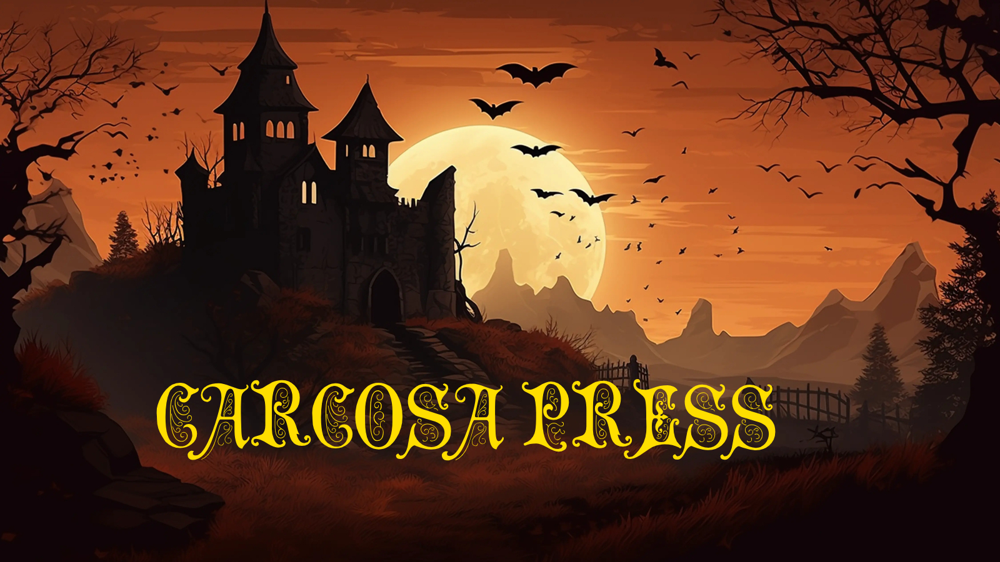
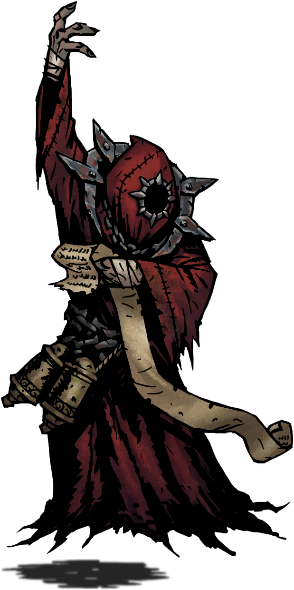
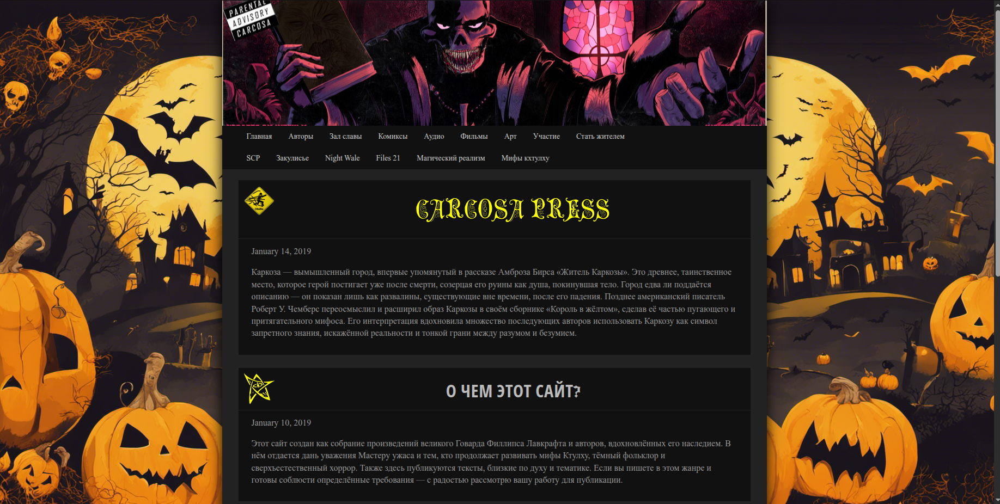

<div align="center">
  
</div>
# 🕯️ Carcosa Press

A digital library and publishers platform for **weird fiction**, **cosmic horror**, and **Lovecraftian tales**. Carcosa Press offers a hand-curated archive of original and classic works from the darkest corners of literature — all wrapped in an eerie, vintage-styled interface.


---
<div>
  
</div>
<p align="left">
## 🧰 Features

- 📰 Paginated story listing (newest first)
- ✍️ Admin panel for adding/editing posts
- 🔒 Optional authentication (for admin)
- 🎃 Dark Gothic UI inspired by [Thuum.org](https://www.thuum.org/)
- Book library available for reading online.
</p>

<p float="left">   </p>
## 📁 Project Structure

```
carcosa-press/
├── public/
│   └── carcosa-banner.png
├── src/
│   ├── components/
│   │   ├── Header.jsx
│   │   ├── PostList.jsx
│   │   ├── PostDetail.jsx
│   │   └── AdminPanel.jsx
│   ├── App.jsx
│   ├── style5.min.css
│   └── index.js
└── README.md
```

---

## 🚀 Getting Started

### 1. Clone the repo

```bash
git clone https://github.com/YOUR_USERNAME/carcosa-press.git
cd carcosa-press
```

### 2. Install dependencies

```bash
npm install
```

### 3. Start the development server

```bash
npm run dev
```

The site will be live at: [http://localhost:3000](http://localhost:3000)

---

## 🔐 Admin Access

The `/admin` route allows you to post new stories.
In a real setup, secure it with:
- JWT Auth
- Firebase Auth
- Magic Link

---

## 💸 Support the Project

Carcosa Press is powered by fans of cosmic horror.
You can support it via symbolic one-time donation tiers (Stripe integration planned):

| Tier Name                              | Price |
|----------------------------------------|-------|
| 🕵️ Seeker of the Unseen               | $5    |
| 📜 Cultist of the Yellow Sign          | $10   |
| 🐙 “Ohh... I hear the piping...”       | $100  |

---

## ✒️ License

MIT License © 2025  
Inspired by **The King in Yellow**, **H.P. Lovecraft**, and the eerie dread of the unknown.

---

> _"Along the shore the cloud waves break,  
> The twin suns sink behind the lake,  
> The shadows lengthen in Carcosa."_  
> — Robert W. Chambers
